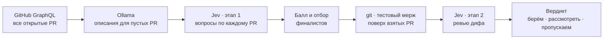

<div align="center">

<picture>
  <source media="(prefers-color-scheme: dark)" srcset="docs/brand/pr-scout-lockup-dark.svg">
  
</picture>


**Какие pull request стоит взять — за пару минут и 30 центов вместо дня ревью.**

Вставьте ссылку на репозиторий GitHub. Scout соберёт все открытые PR, допишет пустые описания локальной моделью,
прогонит каждый через [Jev](https://docs.typesafe.ai) и разложит по трём колонкам: **берём**, **рассмотреть**, **пропускаем** — с причинами.

[Быстрый старт](#быстрый-старт) · [Как это работает](#как-это-работает) · [Как считается балл](#как-считается-балл) · [Стоимость](#сколько-это-стоит) · [Настройка](#настройка)

</div>

> **TL;DR (EN).** PR Scout triages every open pull request of a GitHub repository. It fetches PRs via GraphQL,
> fills in missing descriptions with a local Ollama model, asks [Jev](https://docs.typesafe.ai) typed questions about each
> PR, test-merges the finalists with git and reviews their diffs, then shows a take / consider / skip board with reasons.
> 2 981 PRs of a real project cost **$0.34** and **2 minutes**. Self-hosted, one Docker container. UI is in Russian for now.


## Зачем

У популярного open-source проекта сотни и тысячи открытых PR. Мейнтейнеры не успевают, а вам нужно понять, какие фиксы
забрать в свою сборку прямо сейчас. Читать всё руками — дни. Прогнать через генеративную модель — десятки долларов и
непрозрачные «мне кажется». PR Scout отвечает на один вопрос: **что из этого важно именно для вас и безопасно ложится на основную ветку**.

- **Под ваш сценарий.** Вы пишете пару предложений о том, как используете проект, — релевантность считается относительно этого.
- **Прозрачно.** Jev не пишет сочинений, он отвечает на типизированные вопросы вероятностями. Баллы и вердикты собираются из
  ответов обычным кодом — каждую цифру видно в карточке PR и её легко поменять.
- **Проверено git'ом.** Финалисты по очереди мержатся в основную ветку поверх уже взятых PR: конфликт виден до того, как вы потратите время.
- **Дёшево и быстро.** Тысячи PR за минуты и центы. Локальная модель работает бесплатно на вашей видеокарте.
- **Для любого репозитория.** Части системы Scout определяет сам по путям файлов, для своих проектов их можно задать вручную.

## Возможности

| | |
|---|---|
|  | **Карточка PR.** Из чего сложился балл, ответы Jev с вероятностями каждого варианта, результат тестового мержа, CI, ревью кода. |
|  | **Все PR.** Поиск, фильтры по типу, части системы и вердикту, сортировка по любому столбцу, скрытие дублей. |
|  | **Стоимость.** Сколько реально стоил прогон и сколько та же работа стоила бы на Claude Opus, Sonnet и Haiku. |
|  | **Новый проект.** Ссылка на репозиторий, пара слов о вашем сценарии — и полный прогон с прогрессом в реальном времени. |

**Шире PR** — кнопка «Весь цикл» в меню рядом с «Полным прогоном»:

- **Issues.** Jev разбирает все открытые issues: что это, насколько больно, важно ли для вашего сценария. Фильтр «Стоят внимания»
  оставляет важные и решаемые кодом, «Без PR» — те, за которые никто не взялся. Клик по строке открывает карточку issue.
- **Конкуренты.** Несколько PR закрывают одну issue — Jev подсказывает, какой брать.
- **Форки.** Работа, которую не отправили в апстрим. Форки без своих коммитов отсеиваются без запросов compare (на тысячах форков
  это 95%+), клоны одной линии работы схлопываются в одного кандидата.
- **Сборка.** Стек: выбранные PR вливаются по одному поверх уже взятых — что ложится, что конфликтует и какая доля правок апстрима
  попадает в ваши файлы (цена каждого следующего подтяга). Карта мержей: попарные тестовые мержи кандидатов и пять раскладов —
  от «безопасно взять сегодня» до «по одному на подсистему».
- **Отчёт.** Весь цикл одним markdown-файлом — кнопка скачивания в шапке проекта или `scripts/full-cycle.py owner/repo`.

Ещё: несколько проектов в одном окне, живой поток ответов Jev во время прогона (SSE), светлая и тёмная темы, горячие клавиши
(`/` — поиск, `Esc` — закрыть), защита паролем, адаптивная вёрстка.


## Как это работает



1. **Сбор.** GraphQL API GitHub отдаёт все открытые PR: заголовок, описание, файлы, размер, автора и его роль в репозитории.
   Можно оставить только PR сообщества — без владельцев, мейнтейнеров и коллабораторов — и исключить отдельных авторов.
2. **Описания.** Если описание короче 200 символов, LLM читает диф и пишет короткое описание: локальная модель
   в [Ollama](https://ollama.com) или любая через OpenAI-совместимый API (NordRouter, OpenRouter, OpenAI, свой эндпоинт).
   Оно помечено как сгенерированное и идёт только в оценку, в GitHub ничего не отправляется.
3. **Этап 1 — все PR.** Jev получает заголовок, описание и список файлов и отвечает на вопросы: тип изменения, часть системы,
   релевантность вашему сценарию, серьёзность бага, ценность фичи и десяток вопросов «да/нет» с вероятностью.
4. **Отбор.** Из ответов считается балл 0–100, дубли (тот же issue или тот же заголовок) схлопываются, лучшие N идут дальше.
5. **Мерж.** Scout клонирует репозиторий и по очереди мержит финалистов в основную ветку поверх PR, которые вы уже взяли.
   Если задан `GITHUB_TOKEN`, подтягивается статус CI — нестабильные e2e и боты-ревьюеры не считаются.
6. **Этап 2 — ревью кода.** Jev читает реальный диф: качество, соответствие описанию, подозрительный код, лишние изменения,
   настоящие ли тесты, меняется ли поведение по умолчанию, нет ли рекламы.
7. **Вердикт** собирается правилами из ответов обоих этапов, у каждого есть человеческие причины.

### Что такое Jev

[Jev](https://docs.typesafe.ai) от TypeSafe — не чат-модель. Он принимает «состояние» (здесь — PR) и набор типизированных
вопросов и возвращает откалиброванные вероятности:

| Тип | Что возвращает | Пример в Scout |
|---|---|---|
| `choice` | распределение по вариантам | тип изменения, часть системы |
| `score` | оценку по шкале с вероятностями уровней | релевантность 0–3, серьёзность бага 0–4 |
| `noul` | вероятность «да» | «падают ли запуски без этого фикса?», «подозрительный ли код?» |

Поэтому оценка дешёвая, быстрая и воспроизводимая, а логика решения остаётся у вас в коде.

## Как считается балл

Балл 0–100 из ответов этапа 1, отдельно для фиксов и фич:

| Фиксы (bugfix, security, performance) | | Фичи | |
|---|---:|---|---:|
| релевантность вашему сценарию | 40 | релевантность вашему сценарию | 40 |
| вред без фикса × частота случая | 25 | ценность фичи | 30 |
| серьёзность бага | 15 | действительно новая возможность | 15 |
| полезно всем, а не одному пользователю | 10 | полезно всем | 10 |
| есть тесты | 5 | есть тесты | 5 |
| понятное описание | 5 | | |

Штрафы: рискованная область (до −12), большой PR (−8 от 1000 строк, −18 от 2500), давно не обновлялся (−5 после 30 дней).
Документация, рефакторинг, зависимости и прочее получают максимум 10 — они не должны вытеснять фиксы.

**Вердикт** после этапа 2:

- **Пропускаем** — конфликт при мерже, подозрительный код, реклама, слабое качество (< 1.5/3) или код не совпадает с описанием.
- **Берём** — серьёзный баг в частом сценарии или сильная новая фича, и нет ни одной оговорки.
- **Рассмотреть** — всё остальное: красный CI, рискованная область, лишние изменения в дифе, смена поведения по умолчанию, больше 1500 строк.

Все вопросы и формулы — в [`app/scoring.py`](app/scoring.py), в интерфейсе они показаны на вкладке «Как оценивает».

## Сколько это стоит

Реальный прогон на [paperclipai/paperclip](https://github.com/paperclipai/paperclip):

| | PR | Время | Токены | Стоимость |
|---|---:|---:|---:|---:|
| Этап 1 · все PR | 2 981 | 99 с | 7,2 M | $0,30 |
| Этап 2 · ревью финалистов | 120 | 21 с | 0,9 M | $0,04 |
| **Итого Jev** | | **2 мин** | **8,1 M** | **$0,34** |

Та же работа генеративной моделью (те же входные токены плюс ~3 M токенов ответа, цены Anthropic):

| Модель | Обычно | Batch API |
|---|---:|---:|
| Claude Opus 5.5 | ≈ $96 | ≈ $48 |
| Claude Sonnet 5 | ≈ $48 | ≈ $24 |
| Claude Haiku 4.5 | ≈ $24 | ≈ $12 |

То есть в 35 раз дешевле самого дешёвого варианта и в 280 раз дешевле Opus. Описания через Ollama бесплатны:
`qwen3.5:9b` на Tesla V100 пишет ~90 токенов/с.

## Быстрый старт

Нужны Docker и ключ Jev ([console.typesafe.ai](https://console.typesafe.ai)).

```bash
git clone https://github.com/gentslava/pr-scout.git
cd pr-scout
cp .env.example .env     # впишите TYPESAFE_API_KEY, APP_PASSWORD, GITHUB_TOKEN
docker compose up -d --build
```

Откройте <http://localhost:8000>, нажмите «Добавить репозиторий» и вставьте ссылку.

### Модель для описаний (необязательно)

Пустые описания PR дописывает LLM. Провайдер и модель выбираются в настройках каждого проекта из тех, что настроены на сервере;
список моделей подтягивается у провайдера.

| Провайдер | Как включить |
|---|---|
| Ollama на хосте | ничего: Scout найдёт её через `host.docker.internal` |
| NordRouter | `NORDROUTER_API_KEY` (тот же ключ, что для Jev) |
| OpenRouter | `OPENROUTER_API_KEY` |
| OpenAI | `OPENAI_API_KEY` |
| Любой OpenAI-совместимый: vLLM, LM Studio, DeepSeek, Groq, свой шлюз | `LLM_API_URL` (+ `LLM_API_KEY`, `LLM_API_NAME`, `LLM_MODEL`) |
| Несколько своих сразу | `LLM_PROVIDERS` — JSON-массив `{"id", "name", "url", "key", "model"}`, пример в `.env.example` |

Новые модели OpenAI, которые не принимают `max_tokens`, работают без настройки: запрос повторяется с `max_completion_tokens`.

Ollama должна слушать не только localhost:

```bash
# systemd
sudo systemctl edit ollama   # [Service] Environment="OLLAMA_HOST=0.0.0.0:11434"
ollama pull qwen3.5:9b
```

Без провайдера шаг описаний просто выключен.

### Без Docker

```bash
# фронт: собирается в app/static
cd web && npm ci && npm run build && cd ..

# бэкенд
python3 -m venv .venv && . .venv/bin/activate
pip install -r requirements.txt
DATA_DIR=./data TYPESAFE_API_KEY=... uvicorn main:app --app-dir app --port 8000
```

### Разработка фронта

```bash
cd web && npm run dev   # Vite на :5173, /api проксируется на бэкенд :8000 (API_URL, чтобы поменять)
```

## Настройка

### Переменные окружения

| Переменная | | Описание |
|---|---|---|
| `TYPESAFE_API_KEY` | один из двух | ключ Jev у TypeSafe |
| `NORDROUTER_API_KEY` | один из двух | ключ Jev у NordRouter (тот же Jev, $0.05 за 1M входных токенов); он же включает NordRouter для описаний |
| `JEV_PROVIDER` | | `typesafe` или `nordrouter`; без него провайдер определяется по заданному ключу, при обоих — TypeSafe |
| `JEV_API_URL`, `JEV_MODEL`, `JEV_PRICE_PER_MTOK` | | переопределить эндпоинт, модель и цену за 1M токенов (по умолчанию — значения выбранного провайдера) |
| `APP_PASSWORD` | рекомендуется | пароль для входа (HTTP Basic, логин любой) |
| `GITHUB_TOKEN` | рекомендуется | токен без прав: лимит 5000 запросов/ч вместо 60 и статус CI финалистов |
| `OLLAMA_URL` | | адрес Ollama, по умолчанию `http://host.docker.internal:11434` |
| `OPENROUTER_API_KEY`, `OPENAI_API_KEY` | | включают этих провайдеров для описаний |
| `LLM_API_URL`, `LLM_API_KEY`, `LLM_API_NAME`, `LLM_MODEL`, `LLM_PROVIDERS` | | свои OpenAI-совместимые провайдеры для описаний, см. «Модель для описаний» |
| `DESCRIBER_MODEL` | | модель NordRouter для описаний по умолчанию, `google/gemini-3.1-flash-lite` |
| `DESCRIBER_WORKERS` | | параллельные запросы к облачному провайдеру описаний, по умолчанию 6 |
| `JEV_STAGE1_WORKERS`, `JEV_STAGE2_WORKERS` | | параллельные запросы к Jev, по умолчанию 14 и 10 (у NordRouter лимит 15 rps) |
| `JEV_MERGE_WORKERS` | | параллельные тестовые мержи в git worktree, по умолчанию 4 |
| `FORK_REST_WORKERS`, `FORK_LIST_WORKERS` | | параллельность разбора форков, по умолчанию 16 и 8 |
| `DATA_DIR` | | где хранить данные, по умолчанию `/data` |
| `SCOUT_PORT` | | порт на хосте для `docker compose`, по умолчанию `8000` |

### Настройки проекта

Всё редактируется на вкладке «Настройки»:

- **Как вы используете проект** — главный параметр: относительно этого текста Jev оценивает релевантность.
- **Только PR сообщества** и **исключить авторов** — кого не рассматривать.
- **Уже взятые PR** — номера или ссылка на текстовый файл со списком. Их Scout не предлагает, а финалистов мержит поверх них.
- **Финалистов** — сколько лучших PR идёт на мерж и ревью кода.
- **Части системы** — определяются автоматически по путям файлов; для своего проекта можно задать вручную с описаниями.

### Пресеты

Файл `presets/<owner>__<repo>.json` задаёт настройки по умолчанию для конкретного репозитория: части системы с описаниями,
исключённых авторов, список уже взятых PR. Пример — [`presets/paperclipai__paperclip.json`](presets/paperclipai__paperclip.json).

## API

Интерфейс работает поверх небольшого JSON API, его можно дёргать из скриптов и CI:

```
GET  /api/projects                     список проектов
POST /api/projects                     {"url": "https://github.com/owner/repo", "profile": "..."}
GET  /api/p/{owner__repo}/summary      итоги, прогоны, сравнение стоимости
GET  /api/p/{owner__repo}/prs          все PR с баллами и вердиктами
GET  /api/p/{owner__repo}/prs/{n}      один PR со всеми ответами Jev
GET  /api/p/{owner__repo}/issues       открытые issues с оценкой Jev и PR, которые их закрывают
GET  /api/p/{owner__repo}/forks        форки с работой, не отправленной в апстрим
GET  /api/p/{owner__repo}/rivals       несколько PR на одну issue: кого брать
GET  /api/p/{owner__repo}/stack        сборка выбранных PR: конфликты и цена поддержки
GET  /api/p/{owner__repo}/map          карта мержей: попарная совместимость и пять раскладов
GET  /api/p/{owner__repo}/report.md    весь цикл одним markdown-отчётом
POST /api/p/{owner__repo}/jobs/full    прогон PR (или fetch · describe · stage1 · stage2)
POST /api/p/{owner__repo}/jobs/everything   весь цикл: PR → issues → конкуренты → форки → стек → карта
                                       (или отдельно: issues · rivals · forks · stack · map)
GET  /api/llm/providers                провайдеры LLM для описаний (без ключей)
GET  /api/llm/{provider}/models        модели провайдера
GET  /api/events                       поток событий прогона (SSE)
```

## Стек

- **Фронт:** React 19, TypeScript, Vite, Tailwind CSS 4, [shadcn/ui](https://ui.shadcn.com) на Radix, TanStack Query и TanStack Table, Recharts, react-hook-form + zod, zustand, lucide, sonner.
- **Бэкенд:** Python 3.12, FastAPI, SSE для живого прогона, git для тестового мержа.
- **Данные:** JSON-файлы в `DATA_DIR`, база не нужна. Один Docker-образ: фронт собирается на первом этапе и отдаётся тем же FastAPI.

## Лицензия

[MIT](LICENSE)
