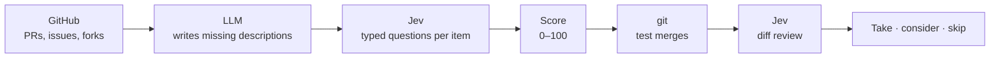

<div align="center">

<picture>
  <source media="(prefers-color-scheme: dark)" srcset="docs/brand/pr-scout-lockup-dark.svg">
  
</picture>

**Which pull requests are worth taking — in minutes and cents, not days of review.**

**English** · [Русский](README.ru.md)

</div>

PR Scout is a self-hosted tool for anyone who runs their own build of an open-source project.
Paste a GitHub repository link: it reads every open pull request, issue and fork, scores each one for **your** use case,
test-merges the candidates with git and sorts them into **take**, **consider** and **skip** — with the reasons.


## What it answers

- **Which PRs to take.** Every open PR scored 0–100, the best ones test-merged and code-reviewed.
- **What hurts with no fix yet.** Important issues nobody has opened a PR for.
- **What never reached upstream.** Fixes and features that live only in forks.
- **Which of several PRs to pick** when they all claim the same issue.
- **What it costs to keep.** Your stack merged for real: what conflicts, and how much of upstream's churn hits your files.

## Why it works

- **Tuned to you.** Describe in two sentences how you use the project — relevance is judged against that.
- **Transparent.** [Jev](https://docs.typesafe.ai) answers typed questions with probabilities, not essays. Plain code turns the answers
  into scores, and every number is explained in the UI.
- **Checked by git.** Candidates are really merged, on top of the PRs you already took.
- **Fast and cheap.** A real project — 3,056 PRs, 2,507 issues and 15,869 forks — in 25 minutes for $0.64.
  The same work on Claude Haiku 4.5 would cost about $49.

<table>
  <tr>
    <td width="50%"><br><b>Verdicts</b> — take, consider, skip, with reasons</td>
    <td width="50%"><br><b>PR card</b> — how the score was built, merge result, code review</td>
  </tr>
  <tr>
    <td><br><b>Issues</b> — what matters and has no PR yet</td>
    <td><br><b>Forks</b> — work that never went upstream</td>
  </tr>
  <tr>
    <td><br><b>Stack</b> — conflicts and maintenance cost, five merge plans</td>
    <td><br><b>Dark theme</b>, several projects, live progress</td>
  </tr>
</table>

> The interface is in Russian for now.

## Quick start

You need Docker and a Jev key from [TypeSafe](https://console.typesafe.ai) or [NordRouter](https://nordrouter.com).

```bash
git clone https://github.com/gentslava/pr-scout.git && cd pr-scout
cp .env.example .env   # set TYPESAFE_API_KEY (or NORDROUTER_API_KEY), GITHUB_TOKEN, APP_PASSWORD
docker compose up -d --build
```

Open <http://localhost:8000>, click **Добавить репозиторий** (add repository) and paste a link.

## How it works



1. **Collect** open PRs, issues and forks from GitHub. Forks with no commits of their own are dropped without a single extra request.
2. **Describe** PRs whose author wrote nothing: any LLM reads the diff (local Ollama or any OpenAI-compatible API).
3. **Ask Jev** about each item: type, part of the system, relevance to you, severity, risk.
4. **Merge** the best candidates into the main branch on top of what you already took, and let Jev review the real diff.
5. **Decide** with plain rules, each with a human-readable reason. The full cycle also exports as one markdown report.

The questions and formulas are in [`app/scoring.py`](app/scoring.py) and [`app/triage.py`](app/triage.py), and on the
**Как оценивает** (how it scores) tab.

## Configuration

| Variable | | |
|---|---|---|
| `TYPESAFE_API_KEY` or `NORDROUTER_API_KEY` | required | Jev key; the provider follows the key you set |
| `GITHUB_TOKEN` | recommended | a token with no scopes: 5,000 requests/hour, issues, forks, CI status |
| `APP_PASSWORD` | recommended | protects the UI (HTTP Basic, any user name) |
| `OPENROUTER_API_KEY`, `OPENAI_API_KEY`, `LLM_API_URL` | optional | LLM for missing descriptions; Ollama on the host works with no key |

Everything else — concurrency, custom LLM endpoints, Jev overrides — is described in [`.env.example`](.env.example).
Per-repository defaults live in [`presets/`](presets).

<details>
<summary>API</summary>

```
GET  /api/projects                        projects
POST /api/projects                        {"url": "https://github.com/owner/repo", "profile": "..."}
GET  /api/p/{owner__repo}/summary         totals, runs, cost
GET  /api/p/{owner__repo}/prs             PRs with scores and verdicts
GET  /api/p/{owner__repo}/issues          issues with scores and covering PRs
GET  /api/p/{owner__repo}/forks           forks with work ahead of upstream
GET  /api/p/{owner__repo}/stack           stack: conflicts and maintenance cost
GET  /api/p/{owner__repo}/map             merge map: pairwise compatibility, five plans
GET  /api/p/{owner__repo}/report.md       the whole cycle as markdown
POST /api/p/{owner__repo}/jobs/full       PR run (or fetch · describe · stage1 · stage2)
POST /api/p/{owner__repo}/jobs/everything the whole cycle (or issues · rivals · forks · stack · map)
GET  /api/events                          live progress (SSE)
```

</details>

## Built with

Python 3.12 and FastAPI, React 19 with TypeScript, Tailwind and shadcn/ui, git. Data is plain JSON files — no database.
One Docker image.

## License

[MIT](LICENSE)
