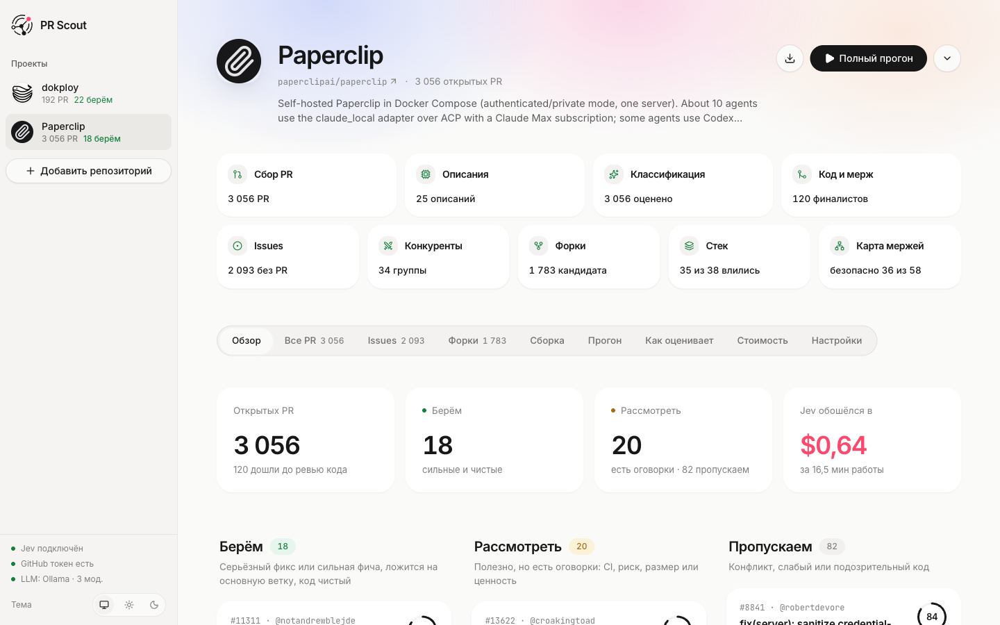
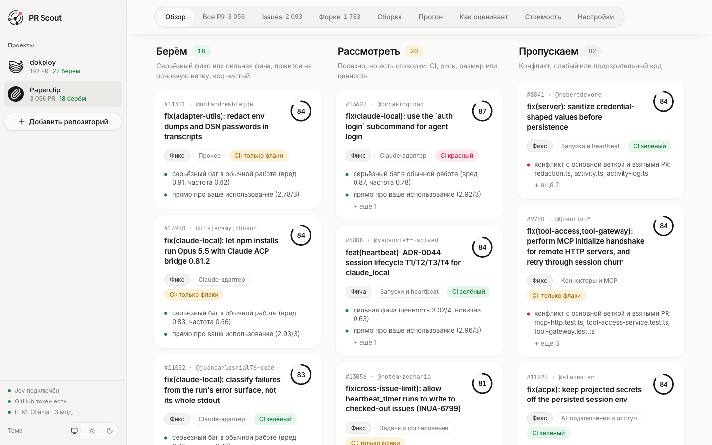
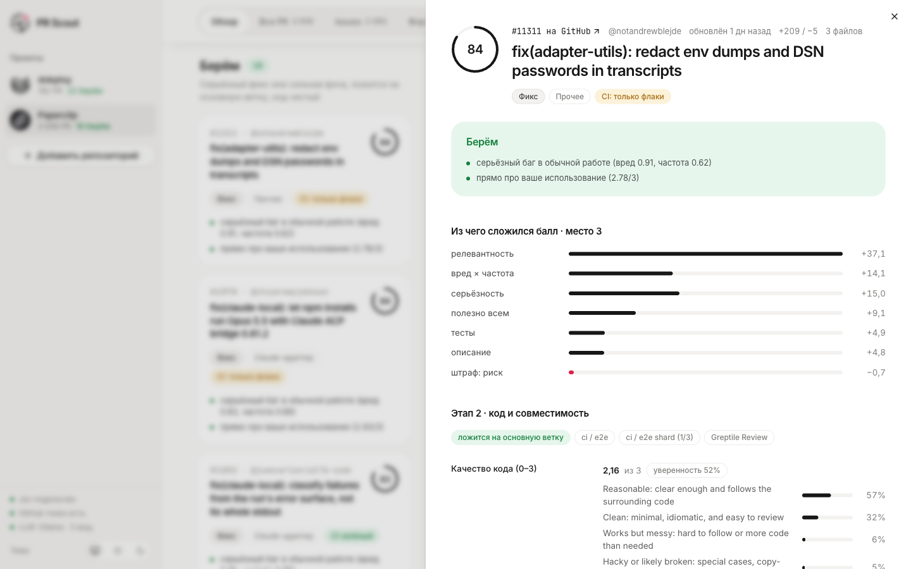
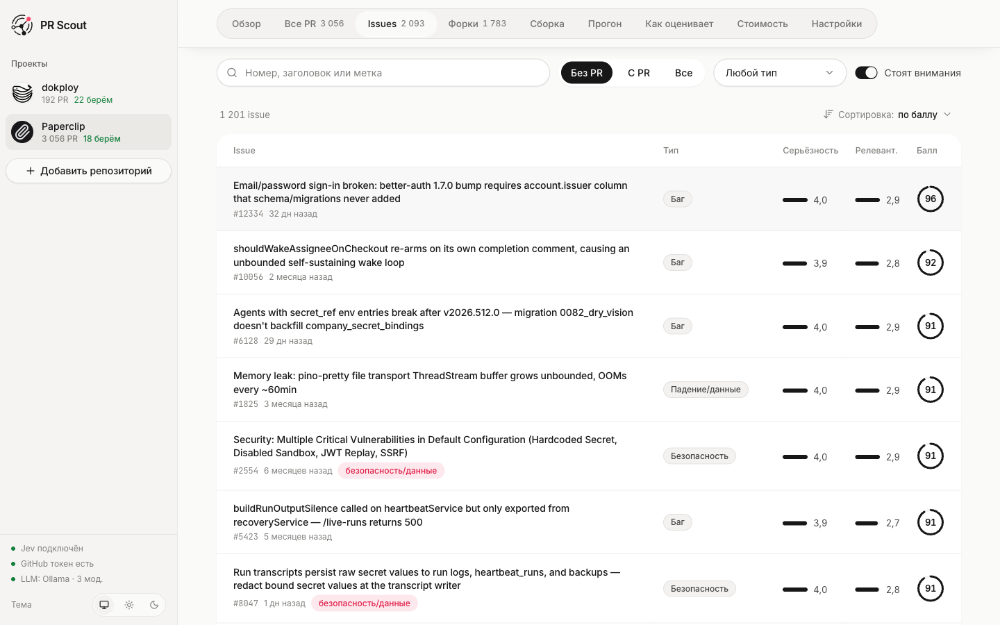
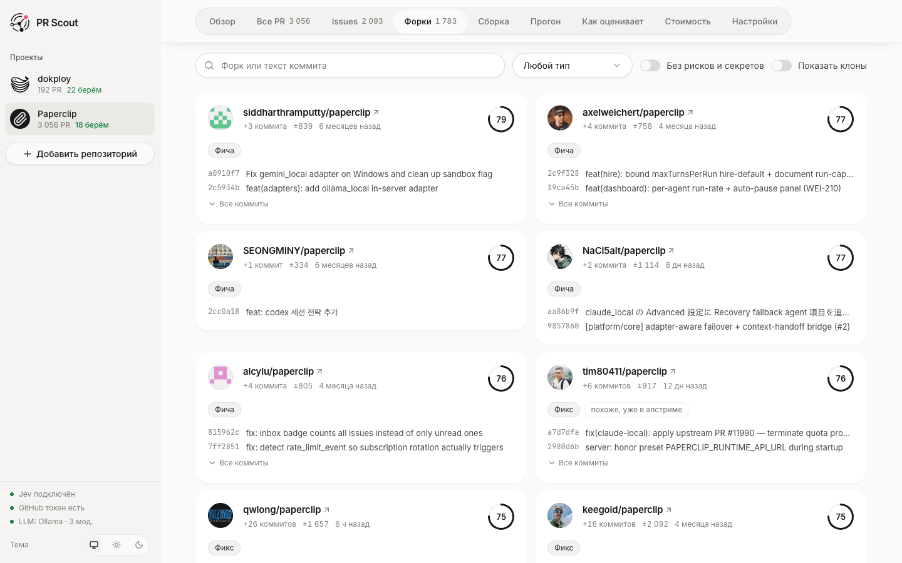
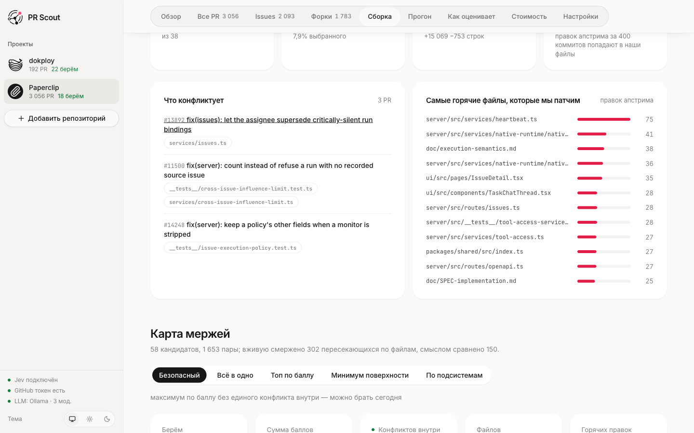
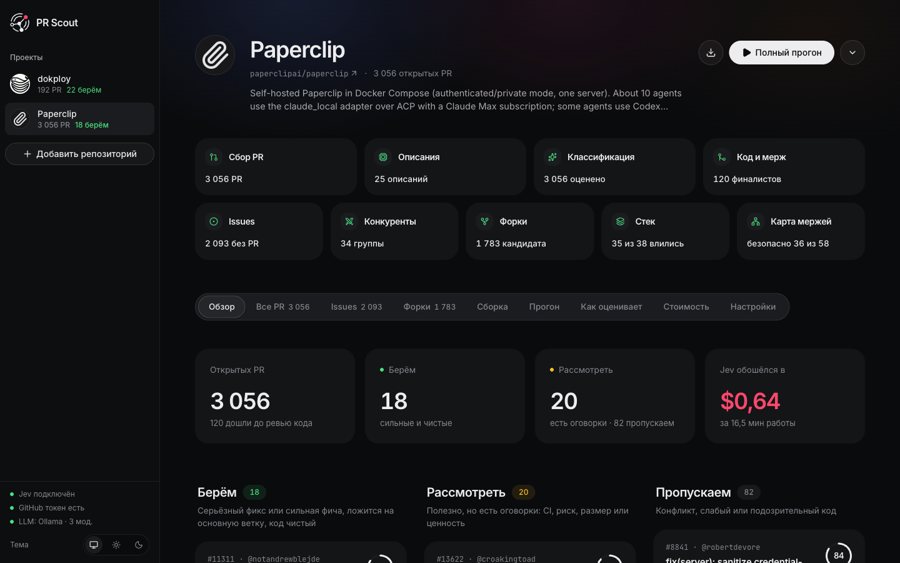
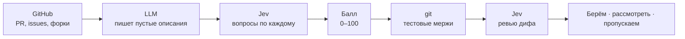

<div align="center">

<picture>
  <source media="(prefers-color-scheme: dark)" srcset="docs/brand/pr-scout-lockup-dark.svg">
  
</picture>

**Какие pull request стоит взять — за минуты и центы, а не за дни ревью.**

[English](README.md) · **Русский**

</div>

PR Scout — self-hosted инструмент для тех, кто держит свою сборку open-source проекта.
Вставьте ссылку на репозиторий GitHub: Scout прочитает все открытые PR, issues и форки, оценит каждый под **ваш** сценарий,
проверит кандидатов тестовым мержем в git и разложит на **берём**, **рассмотреть** и **пропускаем** — с причинами.



## На что отвечает

- **Какие PR взять.** Балл 0–100 для каждого открытого PR, лучшие проходят тестовый мерж и ревью кода.
- **Что болит, а PR нет.** Важные issues, за которые никто не взялся.
- **Что не дошло до апстрима.** Фиксы и фичи, которые живут только в форках.
- **Какой из нескольких PR брать,** когда все закрывают одну и ту же issue.
- **Во что обойдётся поддержка.** Ваш стек собирается по-настоящему: что конфликтует и сколько правок апстрима попадёт в ваши файлы.

## Почему это работает

- **Под вас.** Опишите в двух предложениях, как используете проект, — релевантность считается относительно этого.
- **Прозрачно.** [Jev](https://docs.typesafe.ai) отвечает на типизированные вопросы вероятностями, а не сочинениями. Баллы из ответов
  собирает обычный код, и каждая цифра объяснена в интерфейсе.
- **Проверено git'ом.** Кандидаты действительно мержатся — поверх PR, которые вы уже взяли.
- **Быстро и дёшево.** Реальный проект — 3 056 PR, 2 507 issues и 15 869 форков — за 25 минут и $0,64.
  Та же работа на Claude Haiku 4.5 стоила бы около $49.

<table>
  <tr>
    <td width="50%"><br><b>Вердикты</b> — берём, рассмотреть, пропускаем, с причинами</td>
    <td width="50%"><br><b>Карточка PR</b> — из чего сложился балл, мерж, ревью кода</td>
  </tr>
  <tr>
    <td><br><b>Issues</b> — что важно и ещё без PR</td>
    <td><br><b>Форки</b> — работа, не отправленная в апстрим</td>
  </tr>
  <tr>
    <td><br><b>Сборка</b> — конфликты, цена поддержки, пять вариантов набора</td>
    <td><br><b>Тёмная тема</b>, несколько проектов, прогресс вживую</td>
  </tr>
</table>

## Быстрый старт

Нужны Docker и ключ Jev от [TypeSafe](https://console.typesafe.ai) или [NordRouter](https://nordrouter.com).

```bash
git clone https://github.com/gentslava/pr-scout.git && cd pr-scout
cp .env.example .env   # впишите TYPESAFE_API_KEY (или NORDROUTER_API_KEY), GITHUB_TOKEN, APP_PASSWORD
docker compose up -d --build
```

Откройте <http://localhost:8000>, нажмите **Добавить репозиторий** и вставьте ссылку.

## Как это устроено



1. **Сбор** открытых PR, issues и форков из GitHub. Форки без своих коммитов отсеиваются без единого лишнего запроса.
2. **Описания** для PR, где автор ничего не написал: диф читает любая LLM — локальная Ollama или любой OpenAI-совместимый API.
3. **Вопросы Jev** по каждому: тип, часть системы, важность для вас, серьёзность, риск.
4. **Мерж** лучших кандидатов в основную ветку поверх уже взятого и ревью настоящего дифа.
5. **Решение** по понятным правилам, у каждого — причина словами. Весь цикл выгружается одним markdown-отчётом.

Вопросы и формулы — в [`app/scoring.py`](app/scoring.py) и [`app/triage.py`](app/triage.py) и на вкладке **Как оценивает**.

## Настройка

| Переменная | | |
|---|---|---|
| `TYPESAFE_API_KEY` или `NORDROUTER_API_KEY` | обязательно | ключ Jev; провайдер выбирается по заданному ключу |
| `GITHUB_TOKEN` | рекомендуется | токен без прав: 5 000 запросов в час, issues, форки, статус CI |
| `APP_PASSWORD` | рекомендуется | пароль на интерфейс (HTTP Basic, логин любой) |
| `OPENROUTER_API_KEY`, `OPENAI_API_KEY`, `LLM_API_URL` | по желанию | LLM для пустых описаний; Ollama на хосте работает без ключа |

Остальное — параллельность, свои LLM-эндпоинты, настройки Jev — описано в [`.env.example`](.env.example).
Настройки по умолчанию для конкретных репозиториев — в [`presets/`](presets).

<details>
<summary>API</summary>

```
GET  /api/projects                        проекты
POST /api/projects                        {"url": "https://github.com/owner/repo", "profile": "..."}
GET  /api/p/{owner__repo}/summary         итоги, прогоны, стоимость
GET  /api/p/{owner__repo}/prs             PR с баллами и вердиктами
GET  /api/p/{owner__repo}/issues          issues с баллами и PR, которые их закрывают
GET  /api/p/{owner__repo}/forks           форки с работой впереди апстрима
GET  /api/p/{owner__repo}/stack           стек: конфликты и цена поддержки
GET  /api/p/{owner__repo}/map             карта мержей: совместимость пар, пять вариантов
GET  /api/p/{owner__repo}/report.md       весь цикл в markdown
POST /api/p/{owner__repo}/jobs/full       прогон PR (или fetch · describe · stage1 · stage2)
POST /api/p/{owner__repo}/jobs/everything весь цикл (или issues · rivals · forks · stack · map)
GET  /api/events                          прогресс вживую (SSE)
```

</details>

## Из чего сделано

Python 3.12 и FastAPI, React 19 на TypeScript, Tailwind и shadcn/ui, git. Данные — обычные JSON-файлы, база не нужна.
Один Docker-образ.

## Лицензия

[MIT](LICENSE)
